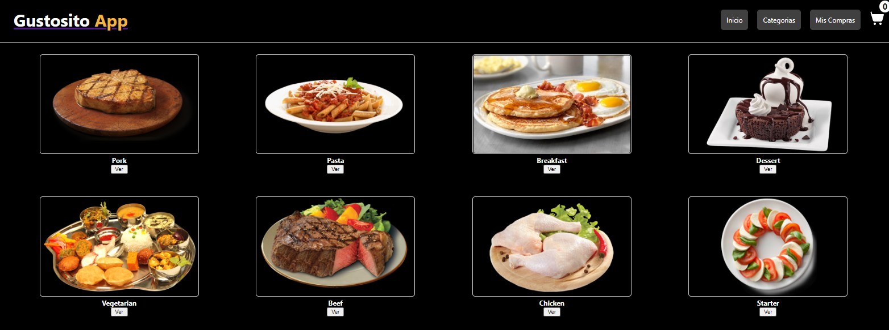

# Nombre del Proyecto

Teinda de Comida

## Descripción

Sistema Basico de comidas para llevar.

## Características

- Característica 1: Categorias
- Característica 2: Productos
- Característica 3: Seleccionar el platillo de comida
- ...

## Capturas de Pantalla

## Instalación

1. Clona este repositorio: `git@github.com:JosanchezDev/pre-entrega1-sanchez.git`
2. Navega al directorio del proyecto: `cd pre-entrega1-sanchez`
3. Instala las dependencias: `npm install`
4. Crea un proyecto en Firebase: [https://firebase.google.com/](https://firebase.google.com/)
5. Configura tu proyecto Firebase en el archivo `.env` utilizando las credenciales proporcionadas por Firebase.
6. Inicia el servidor de desarrollo: `npm start`
7. Abre tu navegador y visita `http://localhost:3000`

## Tecnologías Utilizadas

- ReactJS
- Firebase (Authentication, Firestore, Storage, etc.)
- HTML
- SCSS
- AXIOS

## Contacto

- Nombre: Jheyson Sanchez
- Email: json.dev.sanchez@gmail.com
- GitHub: [tu-JosanchezDev](https://github.com/JosanchezDev)